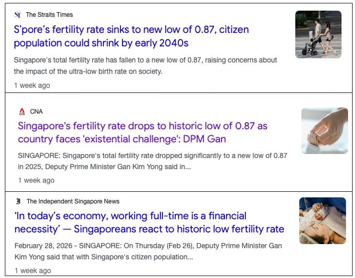
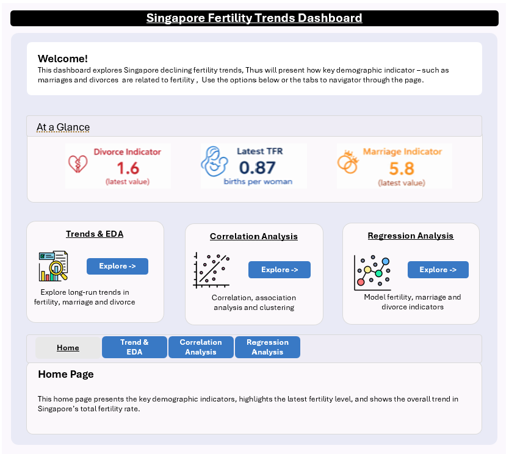
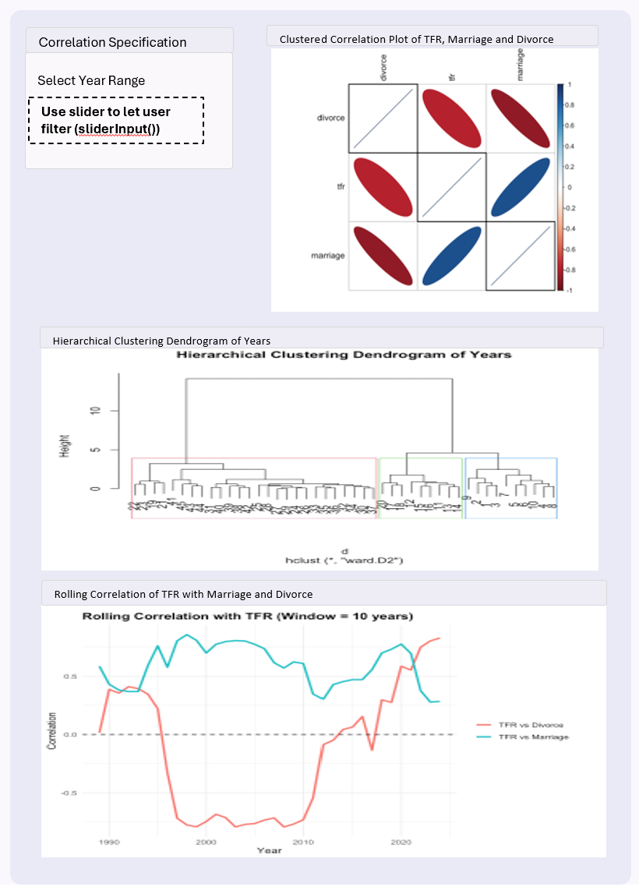
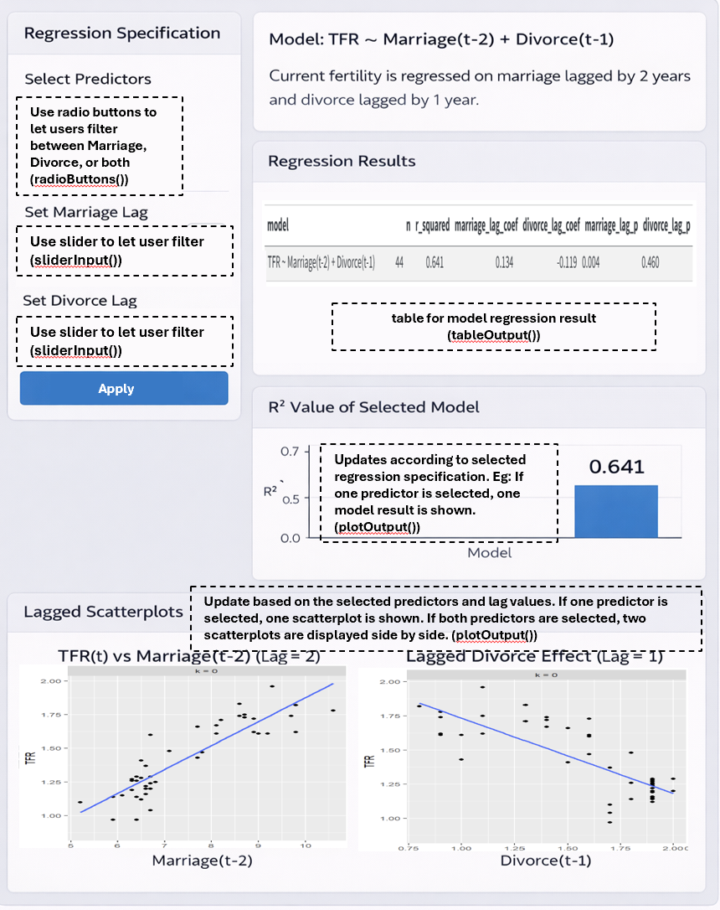

# Background

Singapore’s total fertility rate has fallen to a historic low, raising concerns about population ageing and long-term labour force sustainability. Fertility trends may be influenced by multiple demographic factors, including marriage, divorce, and birth postponement across age groups.

The goal of this project is to build an interactive dashboard that helps users explore (i) how fertility has changed over time, and (ii) whether marriage and divorce indicators are statistically associated with fertility, including possible lag effects.

This take home exercise 2 serve as the prototype for this project.

```{r}

```

## 1.0 Getting Started

Install and launch the following R packages

```{r}
pacman::p_load(tidyverse, readxl, knitr, ggthemes, patchwork, janitor, lubridate, scales)
```

## 2.0 Data

The dataset is provided in Excel format and contains multiple time series. The worksheet includes both metadata rows and actual time-series observations. The raw file consists of 815 rows and 118 columns, indicating that further cleaning is required before analysis.

```{r}
raw0 <- read_xlsx("TE02/data/sg fertilty population.xlsx", col_names = FALSE)
cat("Raw shape:", nrow(raw0), "rows x", ncol(raw0), "cols\n")
```

## 3.0 Data Preparation

To prepare the dataset for analysis and visualisation, the raw worksheet was cleaned in several stages. Since the Excel file contains both metadata rows and actual time-series observations, the data first had to be restructured into an analysis-ready format. The preparation process involved extracting the original series names, identifying valid date rows, removing non-data rows, converting values into numeric format, and creating cleaned datasets for the shared EDA and later analytical tasks.

As this is part of the group project, Group 16 uses the same data preparation process so that all members work from a consistent cleaned dataset before proceeding to our respective analytical tasks.

### 3.1 Extract series names (getting the variable names)

The first row of the worksheet contains the original series labels rather than actual data values/observations. This step extracts those labels, removes extra spaces, fills in any blank names with placeholders, and converts them into clean, unique variable names. A lookup table (series_key) is also created so that the cleaned names can still be traced back to the original labels in the dataset.

```{r}
series_labels <- raw0 %>%
  slice(1) %>%
  select(-1) %>%
  unlist(use.names = FALSE) %>%
  as.character() %>%
  str_squish()

blank_idx <- which(is.na(series_labels) | series_labels == "")
if (length(blank_idx) > 0) series_labels[blank_idx] <- paste0("series_", blank_idx)

series_names <- make.unique(janitor::make_clean_names(series_labels))
series_key <- tibble(series = series_names, label = series_labels)
```

Below shows a small sample of the original series labels and their cleaned variable names.

```{r,echo=FALSE}
sample_name_map <- tibble(original_label = series_labels, cleaned_name = series_names) %>%
  slice(1:10)

knitr::kable(sample_name_map)
```

### 3.2 Assign cleaned column names

After extracting the series labels, the first row is removed from the raw worksheet because it is no longer needed as data. The cleaned series names are then assigned as column names, while the first column is temporarily kept as time_raw so that it can be parsed into valid dates in the next step.

```{r}
raw1 <- raw0 %>%
  slice(-1) %>%
  setNames(c("time_raw", series_names))
```

### 3.3 Parse date rows and identify valid time-series observations (finding which rows are real dates and remove unnecessary rows)

The first column of the worksheet contains a mixture of date values and non-data text. To separate real observations from metadata rows, a custom date-parsing function is used. This function handles both standard date strings and Excel serial dates. Rows are then flagged as valid time-series rows only if the parsed date is not missing and the year falls within a reasonable range. This allows metadata and summary rows to be excluded from further analysis.

```{r}
parse_ceic_date <- function(x) {
  if (inherits(x, "Date")) return(x)
  if (inherits(x, "POSIXt")) return(as.Date(x))

  x_chr <- str_squish(as.character(x))
  dt1 <- suppressWarnings(lubridate::ymd_hms(x_chr, tz = "UTC", quiet = TRUE))
  dt2 <- suppressWarnings(lubridate::ymd(x_chr, quiet = TRUE))
  d_text <- as.Date(dplyr::coalesce(dt1, dt2))

  num <- suppressWarnings(as.numeric(x_chr))
  use_serial <- !is.na(num) & num > 10000 & num < 60000
  d_serial <- as.Date(num, origin = "1899-12-30")

  dplyr::if_else(use_serial, d_serial, d_text)
}

raw1 <- raw1 %>% mutate(date = parse_ceic_date(time_raw))

is_ts_row <- !is.na(raw1$date) &
  lubridate::year(raw1$date) >= 1900 &
  lubridate::year(raw1$date) <= 2100

stopifnot(sum(is_ts_row) > 0)
```

### 3.4 Convert values into numeric format

After identifying the valid time-series rows, the dataset is reshaped into a tidy long format where each row represents one year, one series, and one value. The raw values are then converted into numeric format so that they can be used for plotting and analysis. Where multiple observations exist for the same series within the same year, only the latest non-missing observation is kept.

At this stage, two cleaned datasets are created: df_long_clean for flexible filtering and visualisation, and df_wide_clean for easier year-based comparison across variables.

The cleaned annual panel spans from 1950 to 2025 and contains 117 usable series, showing that the raw worksheet has been successfully transformed into an analysis-ready dataset.

```{r}
df_long_clean <- raw1 %>%
  filter(is_ts_row) %>%
  mutate(year = lubridate::year(date)) %>%
  pivot_longer(
    cols = all_of(series_names),
    names_to = "series",
    values_to = "value_raw"
  ) %>%
  mutate(value = readr::parse_number(as.character(value_raw))) %>%
  filter(!is.na(value)) %>%
  group_by(series, year) %>%
  slice_max(order_by = date, n = 1, with_ties = FALSE) %>%
  ungroup() %>%
  arrange(series, year)

df_wide_clean <- df_long_clean %>%
  select(year, series, value) %>%
  pivot_wider(names_from = series, values_from = value) %>%
  arrange(year)

cat("Annual panel year range:", min(df_wide_clean$year), "to", max(df_wide_clean$year), "\n")
cat("Non-missing series:", n_distinct(df_long_clean$series), "\n")

```

### 3.5 Create final dataset for EDA and Analytical tasks

This step prepares the final working datasets used in the rest of the report. This is necessary because the cleaned dataset still contains many series, while the report only uses selected subsets for specific charts and analyses.

After identifying the key fertility, marriage, and divorce series, they are combined into a core dataset, analysis_df, for the main analysis. This dataset keeps four columns: year, tfr, marriage, and divorce. Additional datasets are also created for the EDA charts, correlation analysis and regression analysis.

```{r}
pick_series <- function(key_tbl, primary_pattern, fallback_pattern = NULL) {
  out <- key_tbl %>%
    filter(str_detect(str_to_lower(label), primary_pattern)) %>%
    slice(1) %>%
    pull(series)
  if (length(out) == 0 && !is.null(fallback_pattern)) {
    out <- key_tbl %>%
      filter(str_detect(str_to_lower(label), fallback_pattern)) %>%
      slice(1) %>%
      pull(series)
  }
  out
}

tfr_series <- pick_series(series_key, "^fertility rate: per female$")
mar_series <- pick_series(series_key, "crude marriage rate", "marriage")
div_series <- pick_series(series_key, "crude divorce rate", "divorce")

stopifnot(length(tfr_series) == 1, tfr_series %in% df_long_clean$series)
stopifnot(length(mar_series) == 1, mar_series %in% df_long_clean$series)
stopifnot(length(div_series) == 1, div_series %in% df_long_clean$series)

analysis_df <- df_long_clean %>%
  filter(series %in% c(tfr_series, mar_series, div_series)) %>%
  select(year, series, value) %>%
  pivot_wider(names_from = series, values_from = value) %>%
  arrange(year) %>%
  transmute(
    year,
    tfr      = .data[[tfr_series]],
    marriage = .data[[mar_series]],
    divorce  = .data[[div_series]]
  )

tfr_df <- df_long_clean %>%
  filter(series == tfr_series) %>%
  arrange(year)

eda2_df <- df_long_clean %>%
  filter(series %in% c(tfr_series, mar_series, div_series)) %>%
  left_join(series_key, by = "series") %>%
  mutate(panel = case_when(
    series == tfr_series ~ "TFR (births per woman)",
    series == mar_series ~ "Marriage indicator",
    series == div_series ~ "Divorce indicator",
    TRUE ~ label
  ))

asfr_keys <- series_key %>%
  filter(str_detect(label, "^Fertility Rate: Per 1000 Female: Age")) %>%
  mutate(
    age_band = str_extract(label, "\\b\\d{2}\\s*-\\s*\\d{2}"),
    age_band = str_replace_all(age_band, "\\s*", "")
  ) %>%
  arrange(age_band)

asfr_df <- df_long_clean %>%
  semi_join(asfr_keys, by = "series") %>%
  left_join(asfr_keys, by = "series") %>%
  mutate(age_band = factor(age_band, levels = c("15-19","20-24","25-29","30-34","35-39","40-44","45-49")))

corr_df <- analysis_df %>%
  select(tfr, marriage, divorce) %>%
  cor(use = "complete.obs") %>%
  as.data.frame() %>%
  rownames_to_column("var1") %>%
  pivot_longer(-var1, names_to = "var2", values_to = "corr")

lag_cor <- function(x, y, max_lag = 10) {
  tibble(lag = 0:max_lag) %>%
    mutate(cor = map_dbl(lag, \(k) cor(x, dplyr::lag(y, k), use = "complete.obs")))
}

lag_results <- bind_rows(
  lag_cor(analysis_df$tfr, analysis_df$marriage, 10) %>% mutate(series = "Marriage leads TFR"),
  lag_cor(analysis_df$tfr, analysis_df$divorce, 10)  %>% mutate(series = "Divorce leads TFR")
)

lag_m <- 2
lag_d <- 1

analysis_lag <- analysis_df %>%
  mutate(
    marriage_lag = lag(marriage, lag_m),
    divorce_lag  = lag(divorce,  lag_d)
  ) %>%
  drop_na(marriage_lag, divorce_lag, tfr)
```

------------------------------------------------------------------------

## 4.0 EDA

Exploratory data analysis will be performed on the dataset to understand the main demographic trends and identify meaningful patterns before modelling.

The EDA will focus on three questions: when fertility began to decline, whether fertility, marriage, and divorce appear to move together over time, and whether fertility has shifted toward older age groups.

This section is shared between group members of Group 16 because it establishes the context for the later analysis.

:::: callout-note
### 4.1 Trend of total fertility rate over time {.tabset}

::: panel-tabset
#### Visual

```{r, echo=FALSE}
ggplot(tfr_df, aes(x = year, y = value)) +
  geom_line() +
  geom_point(size = 1) +
  labs(
    title = "Singapore Total Fertility Rate (TFR) Over Time",
    x = "Year",
    y = "Births per woman"
  )
```

**Observation:**\
Singapore’s TFR shows a sustained long-run decline from the 1960s to 2025. The sharpest fall occurs from the 1960s through the late 1970s, followed by a slower downward drift with smaller fluctuations. From the mid-1970s onward, TFR remains well below the replacement level of 2.1, and the 2025 value of 0.87 is the lowest in the series, consistent with recent reports describing it as a historic low. A TFR of 0.87 means that, on average, a woman would be expected to have 0.87 children over her lifetime if the fertility rates observed in that year remained constant.

#### Code

``` r
ggplot(tfr_df, aes(x = year, y = value)) + geom_line() + geom_point(size = 1) + labs(title = "Singapore Total Fertility Rate (TFR) Over Time", x = "Year", y = "Births per woman")
```
:::
::::

:::: callout-note
### 4.2 Fertility, Marriage and Divorce Trends {.tabset}

::: panel-tabset
#### Visual

```{r, echo=FALSE}
ggplot(eda2_df %>% filter(year >= 1980), aes(year, value)
) + geom_line() +  facet_wrap(~ panel, scales = "free_y", ncol = 1) + labs(title = "Fertility, Marriage and Divorce Trends", x = "Year", y = "Value")
```

**Observation:**\
The chart shows that from around 1980 onward, fertility continues to decline, marriage generally trends downward, and divorce generally trends upward before stabilizing. Together, these patterns suggest that fertility is changing alongside broader family-formation trends, although the chart alone does not establish causality.

Note: The chart is restricted to 1980 onward because the marriage and divorce indicators are only available from that period, making the overlapping years more suitable for comparison with TFR. The series do not end in exactly the same year because TFR is available up to 2025, while marriage and divorce are only available up to 2024 in the source dataset. This does not materially affect the analysis, since the multivariable comparison is based on the common years where all three indicators are available.

The marriage and divorce indicators refer to crude rates per 1,000 residents. For example, a marriage value of 6.5 means there were 6.5 marriages per 1,000 residents in that year, while a divorce value of 1.9 means there were 1.9 divorces per 1,000 residents.

#### Code

``` r
ggplot(eda2_df %>% filter(year >= 1980), aes(year, value)
) + geom_line() +  facet_wrap(~ panel, scales = "free_y", ncol = 1) + labs(title = "TFR vs Marriage/Divorce trend", x = "Year", y = "Value")
```
:::
::::

:::: callout-note
### 4.3 Age-specific fertility rate by age band over time {.tabset}

::: panel-tabset
#### Visual

```{r, echo=FALSE}
ggplot(asfr_df, aes(year, value, colour = age_band)) +  geom_line(linewidth = 0.9) + labs(title = "Age-Band Fertility Rates (Per 1,000 Females) Over Time", x = "Year", y = "Births per 1,000 females", colour = "Age band")
```

**Observation:**\
Across all age bands, fertility rates decline substantially over the long run, with the steepest drops occurring in younger age groups such as 15–19 and 20–24. Over time, the peak childbearing age shifts later: earlier decades are dominated by the 25–29 group, while from the 2000s onward the 30–34 group becomes the highest. The 35–39 group also remains relatively more persistent than younger groups in recent years. This pattern is consistent with birth postponement, where fertility shifts from women in their 20s toward women in their 30s, even as overall fertility continues to decline.

Note: Age-band series, such as 45–49, are not available for the full historical period in the source dataset. This does not materially affect the interpretation, as the chart is used to show the broad long-run shift in fertility across age groups.

The age-specific fertility rates are measured as births per 1,000 females within each age band. Thus, a value of 100 means there were 100 births per 1,000 females in that age group in that year.

#### Code

``` r
ggplot(asfr_df, aes(year, value, colour = age_band)) +  geom_line(linewidth = 0.9) + labs(title = "Age-Band Fertility Rates (Per 1,000 Females) Over Time", x = "Year", y = "Births per 1,000 females", colour = "Age band")
```
:::
::::

:::: callout-note
### 4.4 Fertility Postponement as Composition Shift (Age-Band Shares) {.tabset}

::: panel-tabset
#### Visual

```{r, echo=FALSE}

if (!exists("asfr_keys")) {
  asfr_keys <- series_key %>%
    filter(str_detect(label, "^Fertility Rate: Per 1000 Female: Age")) %>%
    mutate(age_band = str_extract(label, "\\b\\d{2}\\s*-\\s*\\d{2}"), age_band = str_replace_all(age_band, "\\s*", "")) %>%
    arrange(age_band)
}

stopifnot(nrow(asfr_keys) > 0)

asfr_share_df <- df_long_clean %>%
  semi_join(asfr_keys, by = "series") %>%
  left_join(asfr_keys, by = "series") %>%
  mutate(age_band = factor(age_band, levels = c("15-19","20-24","25-29","30-34","35-39","40-44","45-49"))) %>%
  group_by(year) %>%
  mutate(total_asfr = sum(value, na.rm = TRUE)) %>%
  ungroup() %>%
  mutate(share = value / total_asfr) %>%
  filter(!is.na(share))

ggplot(asfr_share_df, aes(year, share, fill = age_band)) +  geom_area() + scale_y_continuous(labels = scales::percent_format(accuracy = 1)) + labs(title = "Age-Band Fertility Composition Over Time", x = "Year", y = "Share of age-specific fertility", fill = "Age band")
```

**Observation:**\
This chart shows the composition of age-specific fertility over time, where the shares sum to 100%. Over the decades, the share of fertility shifts away from younger age groups, especially 15–19 and 20–24, and gradually becomes more concentrated in older age groups, particularly 30–34 and 35–39. This provides clear visual evidence of birth postponement: even as overall fertility declines, the relative contribution of older age bands becomes more prominent.

Note: This chart complements the age-specific fertility rate chart in section 4.3 by showing how the relative contribution of each age band changes over time, thereby providing clearer evidence of fertility postponement.

#### Code

``` r
if (!exists("asfr_keys")) {
  asfr_keys <- series_key %>%
    filter(str_detect(label, "^Fertility Rate: Per 1000 Female: Age")) %>%
    mutate(age_band = str_extract(label, "\\b\\d{2}\\s*-\\s*\\d{2}"), age_band = str_replace_all(age_band, "\\s*", "")) %>%
    arrange(age_band)
}

stopifnot(nrow(asfr_keys) > 0)

asfr_share_df <- df_long_clean %>%
  semi_join(asfr_keys, by = "series") %>%
  left_join(asfr_keys, by = "series") %>%
  mutate(age_band = factor(age_band, levels = c("15-19","20-24","25-29","30-34","35-39","40-44","45-49"))) %>%
  group_by(year) %>%
  mutate(total_asfr = sum(value, na.rm = TRUE)) %>%
  ungroup() %>%
  mutate(share = value / total_asfr) %>%
  filter(!is.na(share))

ggplot(asfr_share_df, aes(year, share, fill = age_band)) +  geom_area() + scale_y_continuous(labels = scales::percent_format(accuracy = 1)) + labs(title = "Age-Band Fertility Composition Over Time (Share of ASFR)", x = "Year", y = "Share of age-specific fertility", fill = "Age band")
```
:::
::::

## 5.0 Analytical Tasks

This section presents the analytical component of the project. As the broader dashboard is developed as a group project, the analytical tasks are split across members.

My groupmate (Enqi) focuses on correlation analysis, while my focus in this report is on regression-based analysis to examine whether marriage and divorce indicators can statistically explain fertility trends.

The regression component is designed to support the planned Shiny application, where users will be able to interactively vary the lag structure of the predictors. As such, the analysis focuses on a baseline current-year model and lagged models that can later be integrated directly into the interactive dashboard. Because these variables change together over time, the regression results should be interpreted as statistical relationships or associations rather than proof of cause and effect.

:::: callout-note
### 5.1 Baseline Regression Models — Marriage vs Divorce vs Both {.tabset}

These baseline models examine whether fertility is associated with marriage and divorce in the current period. For example, does fertility in year t move with marriage and divorce in year t?

M1 tests whether marriage alone explains fertility, M2 tests whether divorce alone explains fertility, and M3 examines what happens when both marriage and divorce are included together. Because marriage and divorce data are only available up to 2024, the regressions are estimated using the overlapping non-missing years.

::: panel-tabset
#### Visual

```{r, echo=FALSE}
m1 <- lm(tfr ~ marriage, data = analysis_df)
m2 <- lm(tfr ~ divorce,  data = analysis_df)
m3 <- lm(tfr ~ marriage + divorce, data = analysis_df)

fmt_p <- function(x) {
  ifelse(
    is.na(x), NA,
    ifelse(x < 0.001, "<0.001", sprintf("%.3f", x))
  )
}

baseline_tbl <- tibble(
  model = c("M1: TFR ~ Marriage",
            "M2: TFR ~ Divorce",
            "M3: TFR ~ Marriage + Divorce"),
  n = c(nobs(m1), nobs(m2), nobs(m3)),
  r_squared = c(summary(m1)$r.squared,
                summary(m2)$r.squared,
                summary(m3)$r.squared),
  marriage_coef = c(coef(m1)["marriage"], NA, coef(m3)["marriage"]),
  divorce_coef  = c(NA, coef(m2)["divorce"], coef(m3)["divorce"]),
  marriage_p = fmt_p(c(coef(summary(m1))["marriage","Pr(>|t|)"],
                       NA,
                       coef(summary(m3))["marriage","Pr(>|t|)"])),
  divorce_p  = fmt_p(c(NA,
                       coef(summary(m2))["divorce","Pr(>|t|)"],
                       coef(summary(m3))["divorce","Pr(>|t|)"]))
)

knitr::kable(
  baseline_tbl,
  digits = 3,
  caption = "Baseline regression model comparison"
)

ggplot(baseline_tbl, aes(x = model, y = r_squared)) +
  geom_col() +
  geom_text(aes(label = round(r_squared, 3)), vjust = -0.3, size = 3) +
  labs(
    title = "R2 Comparison Across Baseline Regression Models",
    x = "Model",
    y = "R2"
  ) +
  ylim(0, max(baseline_tbl$r_squared) + 0.1)
```

**Observation:**\
The baseline regression comparison shows that both marriage and divorce are individually associated with fertility when entered separately. The marriage-only model explains more variation in fertility (R2=0.771) than the divorce-only model (R2=0.595). When both variables are included together, the model fit does not improve beyond the marriage-only model (R2=0.771) and divorce is no longer statistically significant (p=0.878). This suggests that the two indicators may be capturing overlapping long-run demographic patterns, with marriage appearing to be the stronger predictor in the combined specification.

The coefficient signs are also directionally consistent with the visual trends: marriage has a positive association with fertility, while divorce has a negative association when each is modelled separately.

Note: Although the regression uses 45 overlapping annual observations, the EDA charts do not suggest major isolated outlier years. The series mainly exhibit long-run trends with moderate fluctuations, making the sample acceptable for simple exploratory regression models.

#### Code

``` r
m1 <- lm(tfr ~ marriage, data = analysis_df)
m2 <- lm(tfr ~ divorce,  data = analysis_df)
m3 <- lm(tfr ~ marriage + divorce, data = analysis_df)

baseline_tbl <- tibble(
  model = c("M1: TFR ~ Marriage",
            "M2: TFR ~ Divorce",
            "M3: TFR ~ Marriage + Divorce"),
  n = c(nobs(m1), nobs(m2), nobs(m3)),
  r_squared = c(summary(m1)$r.squared,
                summary(m2)$r.squared,
                summary(m3)$r.squared),
  marriage_coef = c(coef(m1)["marriage"], NA, coef(m3)["marriage"]),
  divorce_coef  = c(NA, coef(m2)["divorce"], coef(m3)["divorce"]),
  marriage_p = c(coef(summary(m1))["marriage","Pr(>|t|)"],
                 NA,
                 coef(summary(m3))["marriage","Pr(>|t|)"]),
  divorce_p  = c(NA,
                 coef(summary(m2))["divorce","Pr(>|t|)"],
                 coef(summary(m3))["divorce","Pr(>|t|)"])
)

knitr::kable(
  baseline_tbl,
  digits = 3,
  caption = "Baseline regression model comparison"
)

ggplot(baseline_tbl, aes(x = model, y = r_squared)) +
  geom_col() +
  geom_text(aes(label = round(r_squared, 3)), vjust = -0.3, size = 3) +
  labs(
    title = "R2 Comparison Across Baseline Regression Models",
    x = "Model",
    y = "R2"
  ) +
  ylim(0, max(baseline_tbl$r_squared) + 0.1)
```
:::
::::

:::: callout-note
### 5.2 Lagged Regression Models — Testing Delayed Effects {.tabset}

These models test for delayed effects. Instead of examining whether fertility is associated with marriage and divorce in the same year, is current fertility more strongly related to marriage or divorce in earlier years, such as one or two years before. This is useful because marriage and childbirth do not always happen immediately one after another. A couple may marry in one year and only have children one or two years later. The lagged models therefore help to check whether earlier marriage or divorce patterns explain current fertility better than the current-year model.

L1 tests whether fertility this year is associated with the marriage rate from two years earlier, L2 tests whether fertility this year is associated with the divorce rate from one year earlier, and L3 examines what happens when both lagged predictors are included together.

::: panel-tabset
#### Visual

```{r, echo=FALSE}
lag_m <- 2
lag_d <- 1

analysis_lag <- analysis_df %>%
  mutate(
    marriage_lag = lag(marriage, lag_m),
    divorce_lag  = lag(divorce, lag_d)
  ) %>%
  drop_na(marriage_lag, divorce_lag, tfr)

m_lag_mar <- lm(tfr ~ marriage_lag, data = analysis_lag)
m_lag_div <- lm(tfr ~ divorce_lag,  data = analysis_lag)
m_lag_both <- lm(tfr ~ marriage_lag + divorce_lag, data = analysis_lag)

fmt_p <- function(x) {
  ifelse(
    is.na(x), NA,
    ifelse(x < 0.001, "<0.001", sprintf("%.3f", x))
  )
}

lag_tbl <- tibble(
  model = c("L1: TFR ~ Marriage(t-2)",
            "L2: TFR ~ Divorce(t-1)",
            "L3: TFR ~ Marriage(t-2) + Divorce(t-1)"),
  n = c(nobs(m_lag_mar), nobs(m_lag_div), nobs(m_lag_both)),
  r_squared = c(summary(m_lag_mar)$r.squared,
                summary(m_lag_div)$r.squared,
                summary(m_lag_both)$r.squared),
  marriage_lag_coef = c(coef(m_lag_mar)["marriage_lag"], NA, coef(m_lag_both)["marriage_lag"]),
  divorce_lag_coef  = c(NA, coef(m_lag_div)["divorce_lag"], coef(m_lag_both)["divorce_lag"]),
  marriage_lag_p = fmt_p(c(coef(summary(m_lag_mar))["marriage_lag","Pr(>|t|)"],
                           NA,
                           coef(summary(m_lag_both))["marriage_lag","Pr(>|t|)"])),
  divorce_lag_p  = fmt_p(c(NA,
                           coef(summary(m_lag_div))["divorce_lag","Pr(>|t|)"],
                           coef(summary(m_lag_both))["divorce_lag","Pr(>|t|)"]))
)

knitr::kable(
  lag_tbl,
  digits = 3,
  caption = "Lagged regression model comparison"
)

ggplot(lag_tbl, aes(x = model, y = r_squared)) +
  geom_col() +
  geom_text(aes(label = round(r_squared, 3)), vjust = -0.3, size = 3) +
  labs(
    title = "R2 Comparison Across Lagged Regression Models",
    x = "Model",
    y = "R2"
  ) +
  ylim(0, max(lag_tbl$r_squared) + 0.1)

make_lag_scatter <- function(df, xvar, yvar = "tfr", lags, xlab = "Indicator") {
  bind_rows(lapply(lags, function(k) {
    df %>%
      transmute(
        year,
        x = dplyr::lag(.data[[xvar]], k),
        y = .data[[yvar]],
        lag = paste0("k = ", k)
      ) %>%
      drop_na()
  })) %>%
    ggplot(aes(x, y)) +
    geom_point() +
    geom_smooth(method = "lm", se = FALSE) +
    facet_wrap(~ lag, scales = "free_x") +
    labs(
      title = paste0("TFR(t) vs ", xlab, "(t-k) across selected lags"),
      x = paste0(xlab, " (lagged)"),
      y = "TFR"
    )
}

p_mar_lag <- make_lag_scatter(
  analysis_df,
  xvar = "marriage",
  lags = c(0, 2),
  xlab = "Marriage"
)

p_div_lag <- make_lag_scatter(
  analysis_df,
  xvar = "divorce",
  lags = c(0, 1),
  xlab = "Divorce"
)

p_mar_lag
p_div_lag
```

**Observation:**\
The lagged regression models examine whether earlier marriage and divorce patterns are associated with current fertility. Among the single-predictor lagged models, lagged marriage explains more variation in fertility (R2 = 0.636) than lagged divorce (R2 = 0.557). When both lagged predictors are included together, the model fit increases only slightly (R2 = 0.641), with lagged marriage remaining statistically significant (p = 0.004) but lagged divorce becoming insignificant (p = 0.460). Compared with the baseline models, the lagged models do not provide a stronger fit, suggesting that delayed effects may exist but are not more informative than the current-year relationship.

The scatterplots show that the direction of association remains consistent across the selected lag values: marriage retains a positive relationship with fertility, while divorce retains a negative relationship. However, the lagged patterns do not appear substantially stronger than the baseline same-year case, which is consistent with the regression results.

Note: The scatterplots above use the same lag values as the regression models so that the visual comparisons align directly with the tested baseline and delayed-effect specifications.

#### Code

``` r
lag_m <- 2
lag_d <- 1

analysis_lag <- analysis_df %>%
  mutate(
    marriage_lag = lag(marriage, lag_m),
    divorce_lag  = lag(divorce, lag_d)
  ) %>%
  drop_na(marriage_lag, divorce_lag, tfr)

m_lag_mar <- lm(tfr ~ marriage_lag, data = analysis_lag)
m_lag_div <- lm(tfr ~ divorce_lag,  data = analysis_lag)
m_lag_both <- lm(tfr ~ marriage_lag + divorce_lag, data = analysis_lag)

fmt_p <- function(x) {
  ifelse(
    is.na(x), NA,
    ifelse(x < 0.001, "<0.001", sprintf("%.3f", x))
  )
}

lag_tbl <- tibble(
  model = c("L1: TFR ~ Marriage(t-2)",
            "L2: TFR ~ Divorce(t-1)",
            "L3: TFR ~ Marriage(t-2) + Divorce(t-1)"),
  n = c(nobs(m_lag_mar), nobs(m_lag_div), nobs(m_lag_both)),
  r_squared = c(summary(m_lag_mar)$r.squared,
                summary(m_lag_div)$r.squared,
                summary(m_lag_both)$r.squared),
  marriage_lag_coef = c(coef(m_lag_mar)["marriage_lag"], NA, coef(m_lag_both)["marriage_lag"]),
  divorce_lag_coef  = c(NA, coef(m_lag_div)["divorce_lag"], coef(m_lag_both)["divorce_lag"]),
  marriage_lag_p = fmt_p(c(coef(summary(m_lag_mar))["marriage_lag","Pr(>|t|)"],
                           NA,
                           coef(summary(m_lag_both))["marriage_lag","Pr(>|t|)"])),
  divorce_lag_p  = fmt_p(c(NA,
                           coef(summary(m_lag_div))["divorce_lag","Pr(>|t|)"],
                           coef(summary(m_lag_both))["divorce_lag","Pr(>|t|)"]))
)

knitr::kable(
  lag_tbl,
  digits = 3,
  caption = "Lagged regression model comparison"
)

ggplot(lag_tbl, aes(x = model, y = r_squared)) +
  geom_col() +
  geom_text(aes(label = round(r_squared, 3)), vjust = -0.3, size = 3) +
  labs(
    title = "R2 Comparison Across Lagged Regression Models",
    x = "Model",
    y = "R2"
  ) +
  ylim(0, max(lag_tbl$r_squared) + 0.1)
```
:::
::::

## 6.0 UI Design

Below is the proposed UI design for the Shiny application. Since this dashboard is developed as a group project, the general UI structure will be shared across group members. However, the analytical modules displayed within the application may differ according to each member’s assigned task.

The prototype will first be developed and tested in Quarto using R code and static outputs. It will then be adapted into a Shiny dashboard with interactive controls such as filters.

### 6.1 Figure 1: Proposed summary layout / Home Page

The Home Page is designed to provide users with a high-level overview of Singapore’s fertility trends and the main purpose of the dashboard. It will include a short introduction to the issue of declining fertility, headline indicators such as the latest total fertility rate, and a brief explanation of the three main areas of analysis: trend exploration, Correlation analysis, and relationship analysis with marriage and divorce indicators.

The purpose of this page is to orient users before they move into the detailed analytical sections. It allows users to quickly understand what the dashboard is about and what questions it can help answer. 

This will be completed by group member Enqi.

```{r}

```

### 6.2 Figure 2: Proposed layout of the EDA page

The EDA page will allow users to interactively explore the main demographic trends in the dataset. This page will include line charts for total fertility rate, marriage, divorce, and age-specific fertility rates. Users will be able to filter the year range and select which age group they wish to display.

The purpose of this page is to help users identify broad patterns before moving into more formal analysis. For example, users can observe when fertility started declining, whether marriage and divorce indicators move in similar or opposite directions, and whether fertility has shifted towards older age groups over time.

Possible Shiny UI components for this page include: (1) sliderInput() for year range, (2) radioButtons() for selecting age bands, (3) using plotOutput() for interactive charts

```{r}
knitr::include_graphics("TE02/EDA.png")
```

### 6.3 Figure 3: Proposed layout of the Analytical Tasks

The Analytical Tasks page will support deeper investigation into the relationship between fertility and related demographic indicators. This section will contain separate modules for correlation analysis and regression analysis.

#### 6.3.1 Correlation Analysis

The Correlation Analysis page is designed to let users interactively examine how fertility is associated with marriage and divorce indicators across different time periods and analytical settings.

The layout will consist of a control panel on the left and an output panel on the right. In the control panel, users will be able to filter the year range to focus on a selected analysis period. 

The output panel will display three main elements. First, a clustered correlation plot will summarise the overall correlation structure between total fertility rate, marriage, and divorce indicators. Second, a hierarchical clustering dendrogram will group years according to similar combinations of fertility, marriage, and divorce patterns so that users can identify broad phases in the demographic series. Third, a rolling correlation chart will show how the correlation between fertility and each indicator changes across time windows, allowing users to assess whether the observed relationships are stable or time-varying.

Possible Shiny UI components for this page include: (1) sliderInput() for year range, (2) plotOutput() for the clustered correlation plot, (3) plotOutput() for the hierarchical clustering dendrogram, and (4) plotOutput() for the rolling correlation chart.

This will be completed by group member Enqi.


```{r}

```

#### 6.3.2 Regression Analysis

The Regression Analysis page is designed to let users interactively examine whether fertility is associated with marriage and divorce indicators under different lag assumptions.

The layout will consist of a control panel on the left and an output panel on the right. In the control panel, users will be able to choose whether the regression should use marriage only, divorce only, or both predictors together. Users will also be able to specify the delayed effect by adjusting separate lag values for marriage and divorce. A lag value of 0 will correspond to the baseline same-year model, while higher lag values will represent delayed-effect models.

The output panel will display three main elements. First, a regression results table will summarise the fitted model, including the sample size, R2, coefficients, and p-values. Second, a column chart will show the R2 value of the selected regression specification so that users can quickly compare how well different lag choices fit the data. Third, scatterplots with fitted regression lines will provide a visual view of the relationship between current fertility and the selected lagged predictor values. These plots help users see whether the direction and apparent strength of the relationship change as the lag settings are adjusted.

Possible Shiny UI components for this page include: (1) radioButtons() for choosing regression specification: marriage only, divorce only, or both, (2) sliderInput() for marriage lag, (3) sliderInput() for divorce lag, (4) tableOutput() for regression results, (5) plotOutput() for the R2 column chart, (6) plotOutput() for the lagged scatterplots

```{r}

```

### 6.4 Conclusion

Overall, this prototype outlines the initial design of a Shiny dashboard for exploring Singapore’s fertility trends. The dashboard is intended to help users understand how fertility has changed over time and how fertility is associated with marriage and divorce indicators.

The design combines exploratory visualisation and analytical modelling within a single interactive application. By including filters, the dashboard allows users to tailor the analysis to their own interests.
