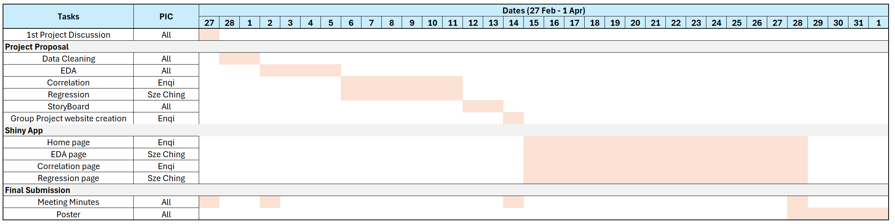

---
title: "Work Allocation for project: Singapore Fertility Trends: A Visual Analytics Study"
author: "G1 T16 - Cheok En Qi and Teong Sze Ching"
date: "March 15, 2026"
date-modified: "last-modified"
execute: 
  eval: true
  echo: true
  warning: false
  freeze: true 
--- 

# Work Allocation Overview

In order to meet the time line for our project, below is our proposed schedule

```{r echo=FALSE, out.width="100%", out.height="350px", fig.align="center"}

```
