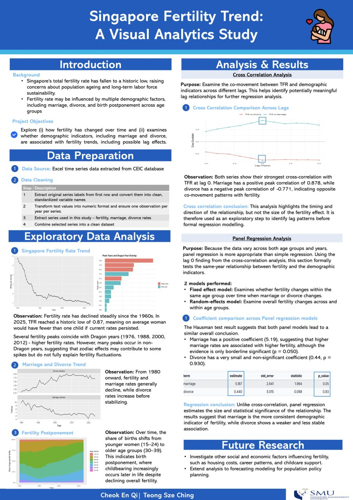

```{r echo=FALSE, out.width="100%", out.height="1000px", fig.align="center"}

```

This poster present Singapore’s fertility trend using demographic data from the CEIC database. It is organised into four parts: data preparation, exploratory data analysis, cross-correlation analysis, and panel regression analysis. First, the fertility, marriage, and divorce data were cleaned and combined into a usable dataset. The exploratory analysis then highlights some of the main patterns, such as the long-term decline in fertility, small spikes during dragon years, and signs that births are happening later across older age groups.

The poster also looks at how fertility moves together with marriage and divorce over time. Cross-correlation analysis is used to check whether these relationships are strongest in the same year or appear with some time lag. On top of that, panel regression is used to test whether marriage and divorce are statistically related to fertility across different age groups and years. Overall, the findings suggest that marriage has a clearer positive relationship with fertility, while divorce appears to have a weaker and less significant relationship.
