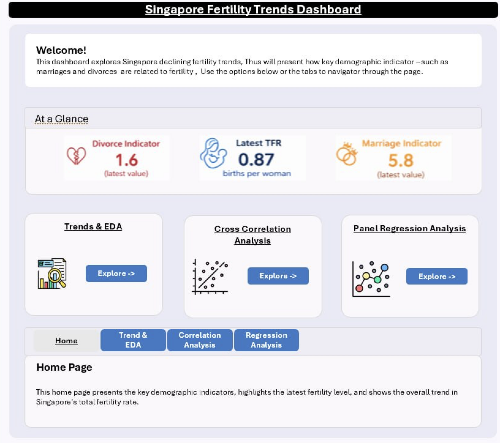
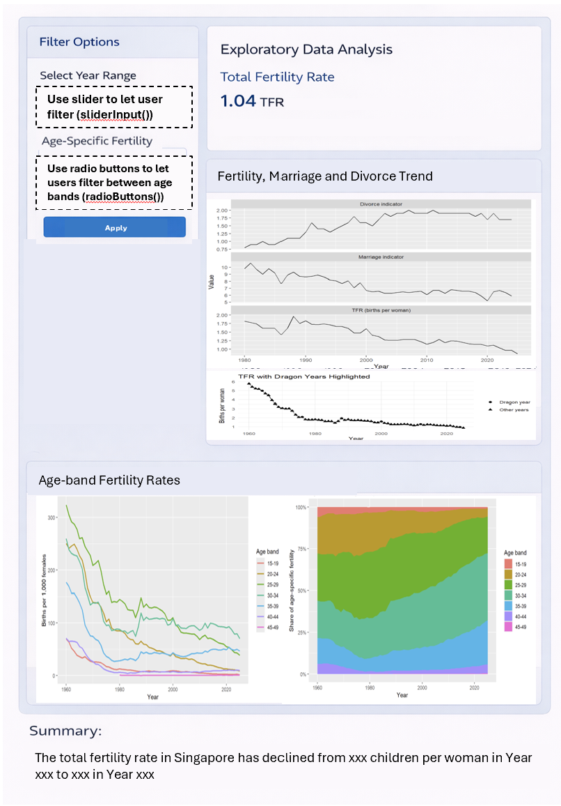
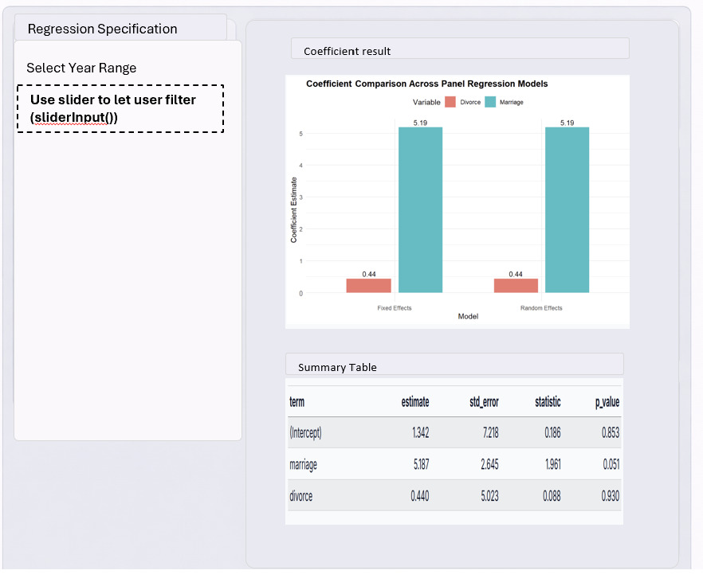

# Story Board Overview

Below is the story board design for our Shiny application. This will be adapted into a Shiny dashboard with interactive controls such as filters.

## 1. Home Page

The Home Page is designed to provide users with a high-level overview of Singapore’s fertility trends and the main purpose of the dashboard. It will include a short introduction to the issue of declining fertility, headline indicators such as the latest total fertility rate, and a brief explanation of the three main areas of analysis: trend exploration, Correlation analysis, and relationship analysis with marriage and divorce indicators.

The purpose of this page is to orient users before they move into the detailed analytical sections. It allows users to quickly understand what the dashboard is about and what questions it can help answer.

```{r}

```

## 2. Proposed layout of the EDA page

The EDA page will allow users to interactively explore the main demographic trends in the dataset. This page will include line charts for total fertility rate, marriage, divorce, and age-specific fertility rates. Users will be able to filter the year range and select which age group they wish to display.

The purpose of this page is to help users identify broad patterns before moving into more formal analysis. For example, users can observe when fertility started declining, whether marriage and divorce indicators move in similar or opposite directions, and whether fertility has shifted towards older age groups over time.

Possible Shiny UI components for this page include: (1) sliderInput() for year range, (2) radioButtons() for selecting age bands, (3) using plotOutput() for interactive charts

```{r}

```

## 3. Proposed layout of the Analytical Tasks

The Analytical Tasks page will support deeper investigation into the relationship between fertility and related demographic indicators. This section will contain separate modules for correlation analysis and regression analysis.

### 3.1 Correlation Analysis

The Correlation Analysis page is designed to let users interactively examine how fertility is associated with marriage and divorce indicators across different time periods and analytical settings.

The layout will consist of a control panel on the left and an output panel on the right. In the control panel, users will be able to filter the year range to focus on a selected analysis period.

The output panel will display three main elements. First, a clustered correlation plot will summarise the overall correlation structure between total fertility rate, marriage, and divorce indicators. Second, a hierarchical clustering dendrogram will group years according to similar combinations of fertility, marriage, and divorce patterns so that users can identify broad phases in the demographic series. Third, a rolling correlation chart will show how the correlation between fertility and each indicator changes across time windows, allowing users to assess whether the observed relationships are stable or time-varying.

Possible Shiny UI components for this page include: (1) sliderInput() for year range, (2) plotOutput() for the clustered correlation plot, (3) plotOutput() for the hierarchical clustering dendrogram, and (4) plotOutput() for the rolling correlation chart.

```{r}
knitr::include_graphics("data/corr.png")
```

### 3.2 Regression Analysis

The Regression Analysis page is designed to let users interactively examine whether fertility is associated with marriage and divorce indicators under different lag assumptions.

The layout will consist of a control panel on the left and an output panel on the right. In the control panel, users will be able to choose whether the regression should use marriage only, divorce only, or both predictors together. Users will also be able to specify the delayed effect by adjusting separate lag values for marriage and divorce. A lag value of 0 will correspond to the baseline same-year model, while higher lag values will represent delayed-effect models.

The output panel will display three main elements. First, a regression results table will summarise the fitted model, including the sample size, R2, coefficients, and p-values. Second, a column chart will show the R2 value of the selected regression specification so that users can quickly compare how well different lag choices fit the data. Third, scatterplots with fitted regression lines will provide a visual view of the relationship between current fertility and the selected lagged predictor values. These plots help users see whether the direction and apparent strength of the relationship change as the lag settings are adjusted.

Possible Shiny UI components for this page include: (1) radioButtons() for choosing regression specification: marriage only, divorce only, or both, (2) sliderInput() for marriage lag, (3) sliderInput() for divorce lag, (4) tableOutput() for regression results, (5) plotOutput() for the R2 column chart, (6) plotOutput() for the lagged scatterplots

```{r}

```

## 4. Package Selection Justification

To support the development of the Shiny application, we selected packages based on clarity of output, ease of integration with Shiny, interpretability and suitability for the project scope.

For visualisation, we selected **ggplot2** as the main charting library because it produces clear and consistent visual output, is easy to customise, and integrates well with Shiny through **plotOutput()**. It is well suited for presenting demographic time-series trends, scatterplots and rolling correlation charts in a structured and readable format.

For correlation analysis, we used the **cor()** function to compute correlation matrices and the **corrplot** package to visualise them. This library was selected because it provides clear graphical representations of correlation structures, including clustered correlation matrices that help highlight relationships among fertility, marriage, and divorce indicators.

For arranging multiple charts in the same output view, we used **patchwork** because it allows plots to be combined in a simple and flexible way while keeping the code readable.

For statistical modelling, we used **lm()** for regression because they are sufficient for the scope of this project. Since the Shiny app is intended to support interactive exploration, simpler and more explainable models were preferred.
